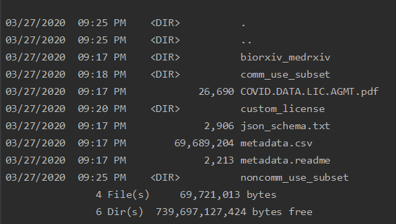
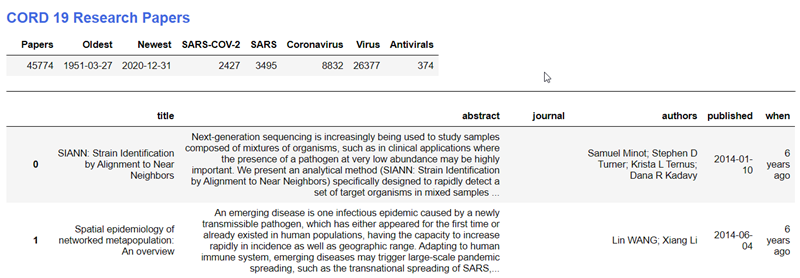
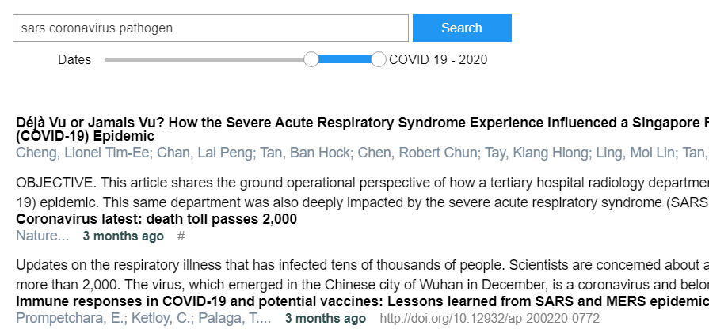

# COVID 19 Open Research Data Challenge Code
This repo contains code and notebooks for the [COVID-19 Open Research Dataset Challenge (CORD-19)](https://www.kaggle.com/allen-institute-for-ai/CORD-19-research-challenge)
on kaggle

# Installing

```{bash}
pip install git+https://github.com/dgunning/cord19.git
```

Login to **Kaggle** and download the [CORD Research Challenge data](https://www.kaggle.com/allen-institute-for-ai/CORD-19-research-challenge)
and extract to a folder called **data**. 

You can also use the [Kaggle python api](https://github.com/Kaggle/kaggle-api) to download this datatet.

```bash
dir data\CORD-19-research-challenge
```


# Usage
The library is meant for use in Jupyter or Kaggle notebooks
```{python}
from cord import ResearchPapers

research_papers = ResearchPapers.load()
```
After loading the research papers you can display in a notebook

```{python}
research_papers
```



# Search
The search function returns the items that match the search query
```{python}
research_papers.searchbar('vaccine transmission'
```


## Search Bar
A more convenient way to search is through the search bar. This displays a search widgets in Jupyter notebook
```{python}
research_papers.searchbar('vaccine transmission')
```



# Selecting Subsets of Research Papers
There are many ways to select subsets of research papers including

- **Papers since SARS** `research_papers.since_sars()`
- **Papers since SARS-COV-2** `research_papers.since_sarscov2()`
- **Papers before SARS** `research_papers.before_sars()`
- **Papers before SARS-COV-2** `research_papers.before_sarscov2()`
- **Papers before a date** `research_papers.before('1989-09-12')`
- **Papers after a date** `research_papers.after('1989-09-12')`
- **Papers that contains a string** `research_papers.contains("Fauci", column='authors')`
- **Papers that match a string (using regex)** `research_papers.match('H[0-9]N[0-9]')`


# Selecting individual Papers
You can select individual papers by using Python indexing **[]**

`research_papers[200]`


